# Saloon Management System — Visual Overview

## System Architecture Diagram

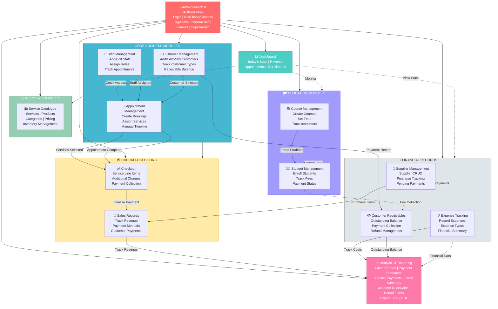

---

## Feature Breakdown by Module

### 🔐 **Authentication & Authorization**
- **Login:** Email + Password authentication with JWT
- **Role-based Access Control:** 4 roles with specific permissions
  - **OrgAdmin:** Full access to business operations
  - **InternalStaff:** Limited to appointments & customer interaction
  - **Finance:** Financial records & reporting
  - **SuperAdmin:** System-wide access
- **Session Management:** JWT token (8-hour expiry) + Org Code isolation

---

### 📊 **Dashboard**
- **Real-time KPIs:**
  - Today's total sales (NPR)
  - Appointments today (clients vs students)
  - Completed appointments + rate
  - Active course enrollments
  - Total revenue (period selector)
  - Top services & inventory status

- **Visualizations:**
  - Weekly appointment volume (bar chart)
  - Upcoming appointments timeline
  - Appointment status distribution (donut chart)

- **Role-based Views:**
  - OrgAdmin/Finance: Full financial view
  - InternalStaff: Operational data only (no revenue)

---

### 👥 **Customer Management**
- **CRUD Operations:**
  - Create customer with optional quick-add from booking
  - View customer profile & history
  - Edit customer details (name, contact, type, etc.)
  - Soft-delete customers

- **Customer Attributes:**
  - Basic info (name, phone, email, address)
  - National ID (unique)
  - Skin type (salon-specific)
  - Customer type classification

- **Customer Dashboard:**
  - Appointment history
  - Outstanding receivable balance
  - Total spent

---

### 👔 **Staff Management**
- **Staff CRUD:**
  - Create staff with auto-generated login credentials
  - Assign roles (OrgAdmin, InternalStaff, Finance)
  - Set salary & department
  - Edit profile information
  - Deactivate staff (soft-delete)

- **Staff Visibility:**
  - Active staff available for appointment assignment
  - Historical records preserved for appointment tracking

---

### 🛍️ **Service & Product Catalogue**
- **Service Management:**
  - Create/Edit/Delete services
  - Set pricing & duration
  - Categorize services
  - Toggle status (Active/Inactive)
  - Price changes don't affect past appointments

- **Product Management:**
  - Track inventory & stock quantities
  - Manage product pricing
  - Link to suppliers for purchases

- **Category Management:**
  - Parent & child category hierarchy
  - Category constraints (can't delete if items linked)

---

### 📅 **Appointment Management**
- **Appointment Lifecycle:**
  - **Create:** Select customer, date, staff, services
  - **Booked Status:** Available for editing
  - **Completed:** Triggers checkout flow
  - **Cancelled:** Non-reversible state

- **Multi-Service Support:**
  - Multiple services per appointment
  - Service-specific pricing & duration
  - Combined total calculation

- **Timeline View:**
  - Upcoming appointments
  - Staff assignment visibility
  - Status tracking

---

### 💳 **Checkout & Billing**
- **Service Line Items:**
  - Review & modify service pricing at checkout
  - Add/remove services before completion
  - Custom service pricing override

- **Additional Billing:**
  - Add non-service charges (products, extras)
  - Describe items or select from catalogue
  - Per-item quantity & pricing

- **Payment Collection:**
  - Multiple payment methods (Cash, Card, Bank Transfer, QR)
  - Partial payment support
  - Zero-payment completion (full credit)
  - Outstanding balance tracking

- **Financial Impact:**
  - Creates SaleRecord
  - Generates PaymentTransaction
  - Creates/updates CustomerReceivable if unpaid

---

### 🏪 **Supplier Management**
- **Supplier CRUD:**
  - Create supplier with contact details
  - Edit supplier information
  - Track supplier history

- **Purchase Orders:**
  - Select supplier & set purchase date
  - Add line items (product + quantity + unit price)
  - Partial payment support
  - Auto-create pending payment if not fully paid

- **Stock Management:**
  - Automatically update product stock on purchase
  - Track stock levels

---

### 💼 **Financial Records**
- **Supplier Payments:**
  - Track supplier payment history
  - Manage pending payment records
  - Payment method logging
  - Receive payment from purchases

- **Customer Receivables:**
  - Outstanding balance by customer
  - Payment collection with multi-method support
  - Refund issuance
  - Status tracking (Outstanding/Partially Paid/Settled)

- **Expense Tracking:**
  - Create expense types
  - Record daily expenses
  - Payment method logging
  - Remarks for context

- **Credit Summary:**
  - Aggregated customer credit view
  - Total credited vs collected
  - Current balance per customer

---

### 📚 **Course Management**
- **Course CRUD:**
  - Create courses with name, description, duration
  - Set course fee/rate
  - Assign instructor (staff member or external)
  - Toggle status (Active/Inactive)

- **Enrollment Management:**
  - View enrolled students per course
  - Track student payment status
  - Fee changes don't affect existing enrollments

- **Dashboard Integration:**
  - Active enrollment count
  - Pending course fees monitoring

---

### 👨‍🎓 **Student Management**
- **Student CRUD:**
  - Register students with contact details
  - Enroll in courses
  - Track personal information
  - Edit student profile

- **Enrollment & Fee Tracking:**
  - Multiple course enrollments per student
  - Fee recording by enrollment
  - Status tracking (Pending/Completed)
  - Partial payment support

- **Payment Collection:**
  - Record fee payments
  - Track remaining balance
  - Auto-mark as completed when fully paid
  - Creates CustomerReceivable for outstanding

---

### 📈 **Analytics & Reporting**
- **Dashboard Reports:**
  - **Sales Report:** Revenue by date, service, customer, payment method
  - **Payment Statement:** All transactions with reference tracking
  - **Supplier Payment Report:** Supplier payments & due dates
  - **Supplier Pending Payments:** Outstanding supplier balances
  - **Credit Summary:** Customer credit overview
  - **Customer Receivable:** Outstanding customer balances

- **Filtering & Export:**
  - Date range selector (Week/Month/Custom)
  - Multi-criteria filtering
  - Export to CSV & PDF
  - Role-based access (Finance role only for sensitive reports)

- **Visualizations:**
  - Revenue vs Expenses over time
  - Top services by volume
  - Payment method distribution
  - Customer credit trends

---

## Key Data Flows

### 1️⃣ **Appointment to Revenue**
```
Create Appointment → Assign Services → Complete Appointment 
→ Checkout & Collect Payment → Create SaleRecord & PaymentTransaction
```

### 2️⃣ **Unpaid Appointment to Receivable**
```
Complete Appointment → Zero/Partial Payment 
→ Create CustomerReceivable → Collection/Refund Workflow
```

### 3️⃣ **Course Enrollment to Fee Collection**
```
Enroll Student → Set Course Fee → Record Fee Payment 
→ Update Receivable if Incomplete
```

### 4️⃣ **Purchase to Supplier Payment**
```
Create Purchase → Add Line Items → Partial/Full Payment 
→ Create/Update SupplierPendingPayment Record
```

### 5️⃣ **Financial Data to Analytics**
```
SaleRecord + PaymentTransaction + CustomerReceivable + Expense 
→ Aggregation & Filtering → Analytics Dashboard
```

---

## System Access Patterns

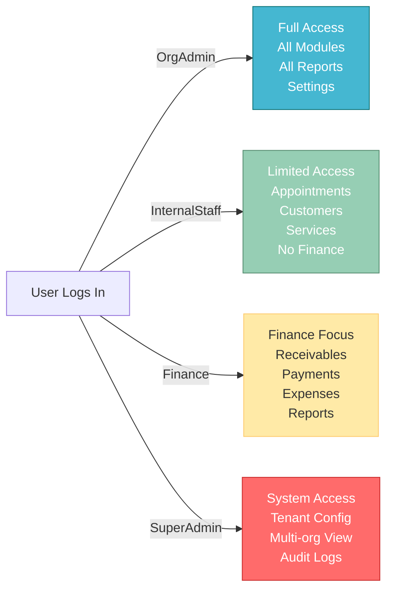

---

## Technology Stack

| Layer | Technology |
|-------|-----------|
| **Frontend** | React 18 + Vite, Next.js (Next.js migration in progress) |
| **Backend** | .NET 8 (ASP.NET Core) |
| **Database** | Multi-tenant database (Master DB + Tenant DBs) |
| **Authentication** | JWT + Role-based Authorization |
| **API** | RESTful API with standardized response envelope |

---

## Tenant Isolation

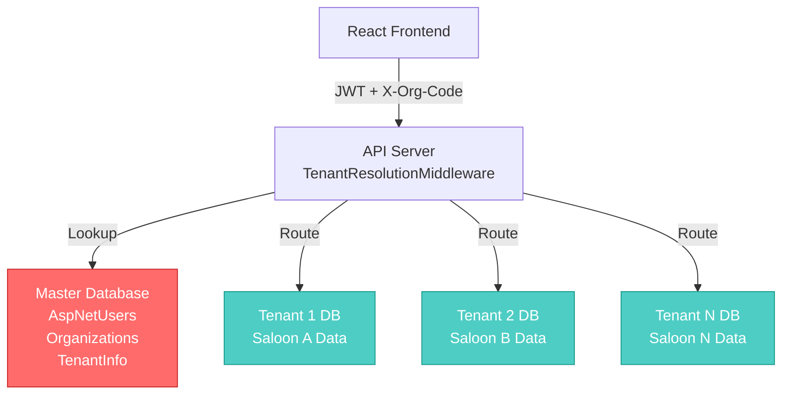

---

---

## Activity Diagrams

### 📅 Appointment Booking & Completion Activity Flow

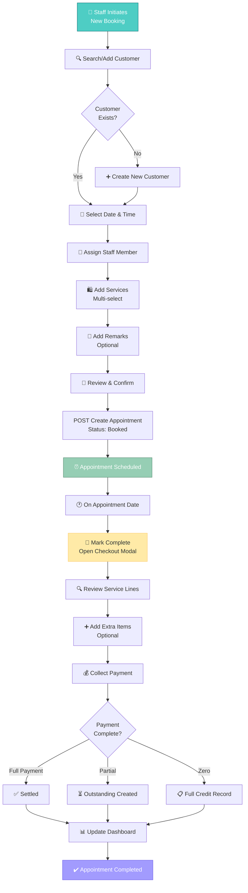

---

### 📚 Course Enrollment & Fee Collection Activity Flow

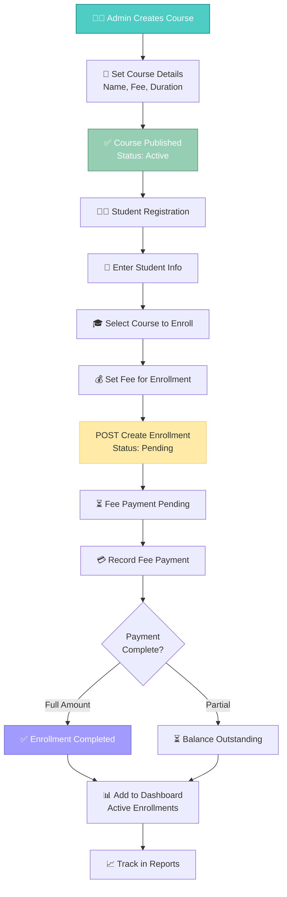

---

### 🏪 Purchase & Supplier Payment Activity Flow

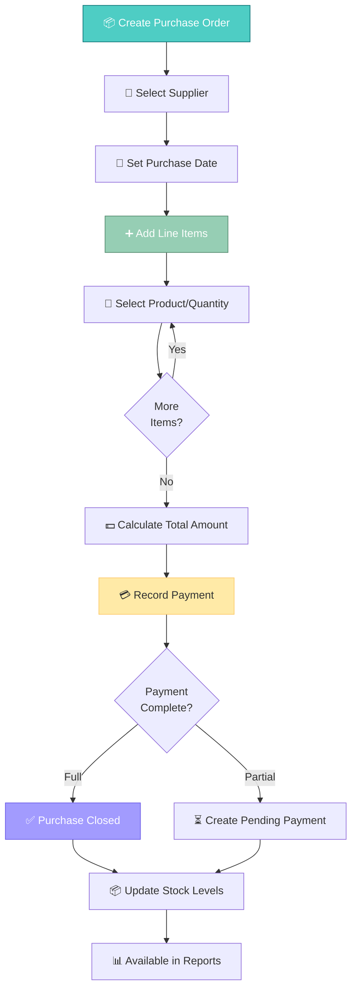

---

## Flow Diagrams (Decision Trees)

### 🔐 Authentication & Authorization Flow

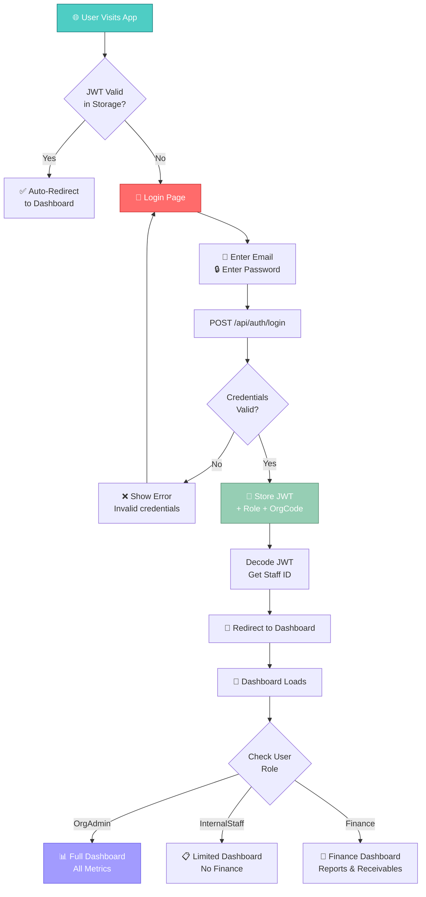

---

### 💳 Payment Decision Flow

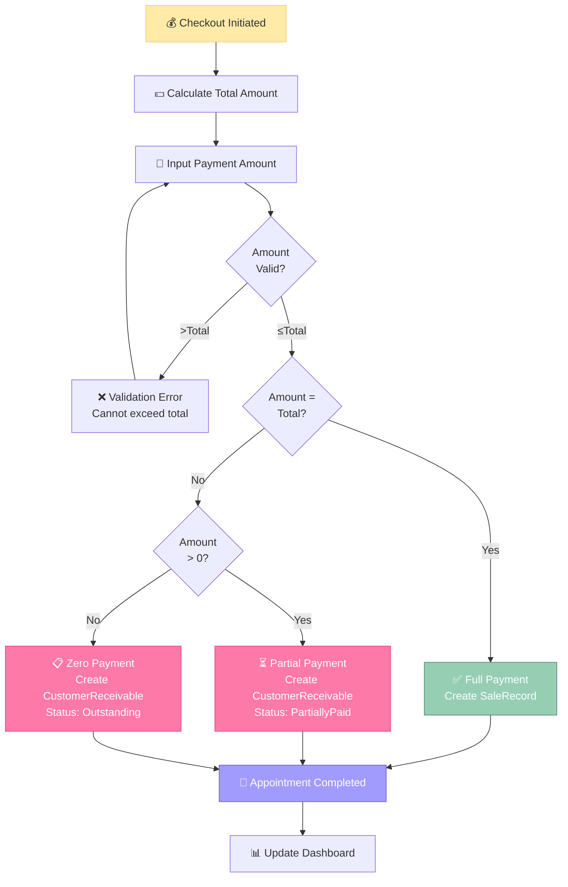

---

### 📊 Report Access Decision Flow

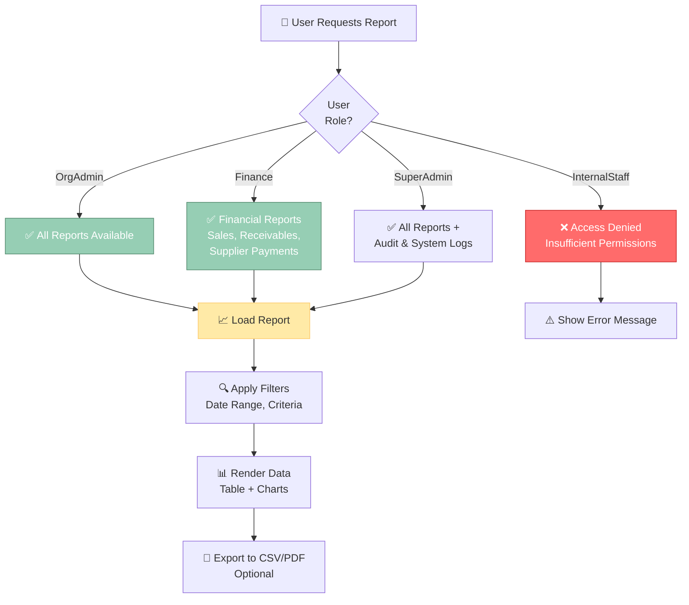

---

## System Component Diagram

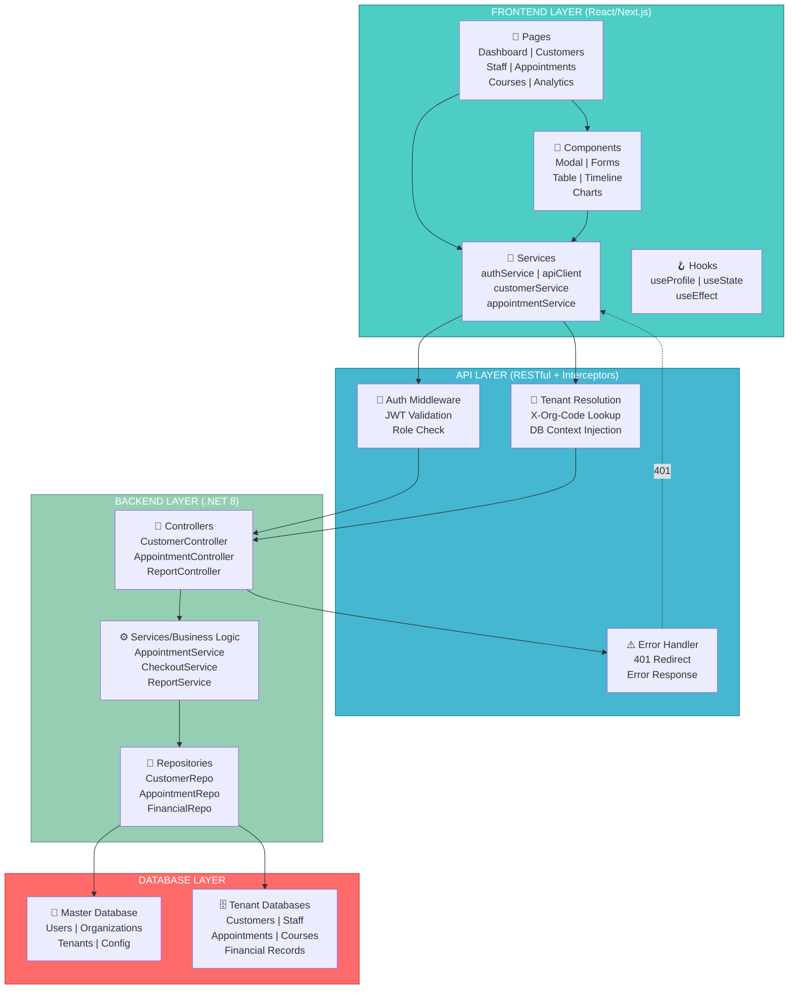

---

## Sequence Diagram - Complete Appointment Workflow

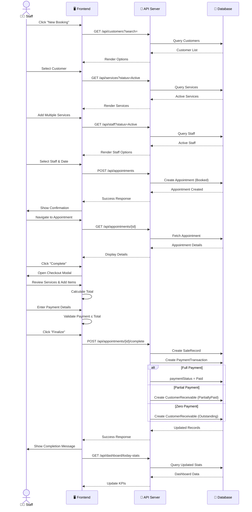

---

## Data Flow Diagram - Revenue Generation Pipeline

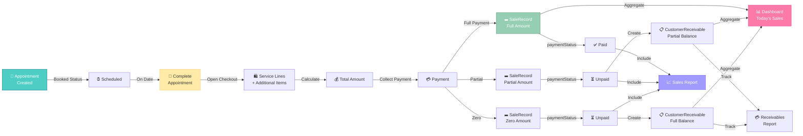

---

## Data Model Relationship Diagram

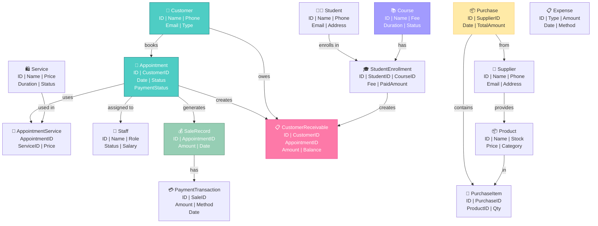

---

## Module Dependency Diagram

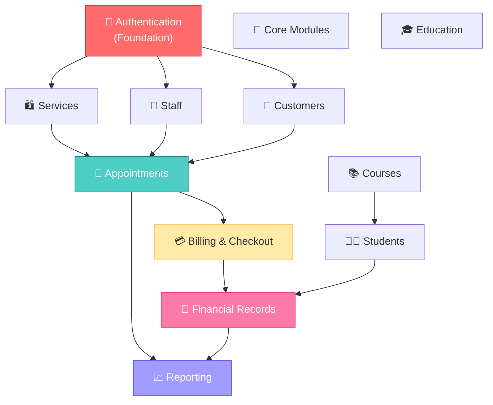

---

*This diagram document provides comprehensive visual representations of the Saloon Management System including activity flows, decision flows, system components, sequence flows, and data relationships. For detailed specifications, refer to the individual documentation files.*
