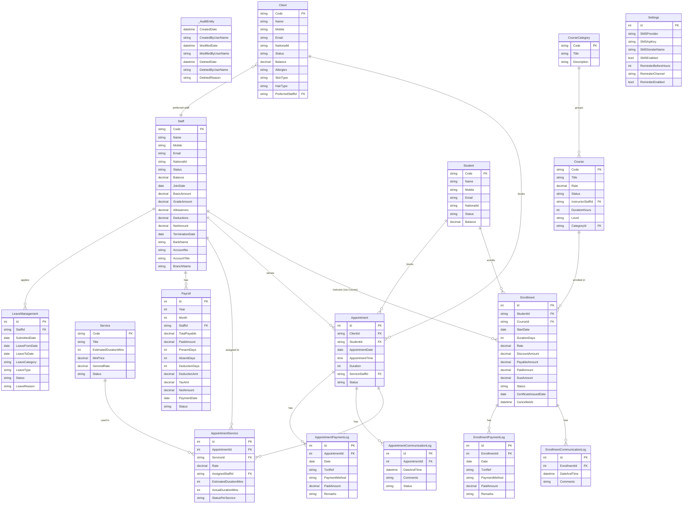
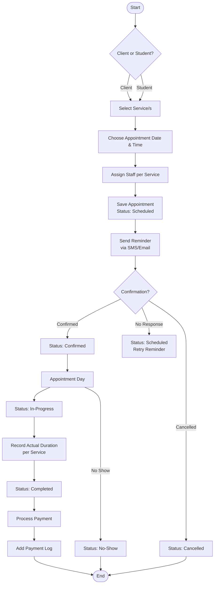
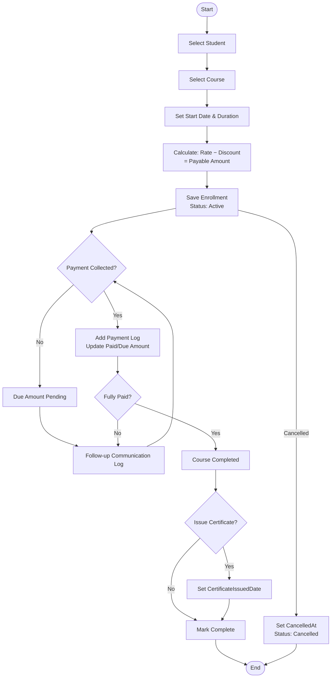
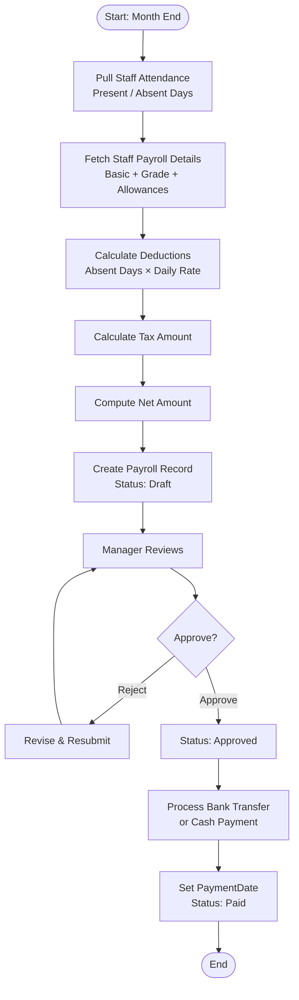
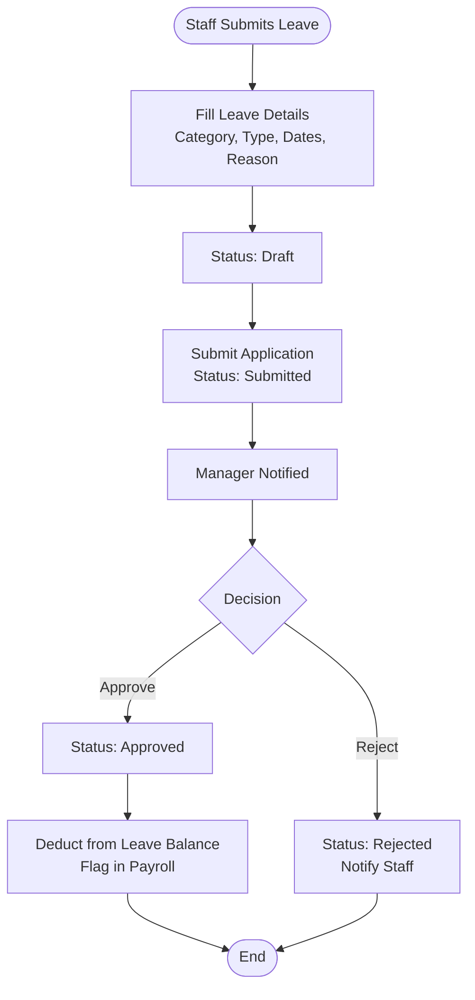

# Saloon — Tenant Database Context

> All entities inherit from `_AuditEntity` which provides: `CreatedDate`, `CreatedByUserName`, `ModifiedDate`, `ModifiedByUserName`, `DeletedDate`, `DeletedByUserName`, `DeletedReason`.

---

## 1. Entities

### 1.1 Staff
Represents salon employees and instructors.

| Field | Type | Notes |
|---|---|---|
| Code | string | Unique identifier |
| Name | string | Full name |
| Address | string | |
| Mobile | string | |
| Email | string | |
| Status | enum | Active / Inactive |
| NationalId | string | |
| Balance | decimal | Running balance |
| Roles | string[] | Multiple roles |

**Payroll Details** *(embedded)*

| Field | Type |
|---|---|
| JoinDate | date |
| BasicAmount | decimal |
| GradeAmount | decimal |
| Allowances | decimal |
| Deductions | decimal |
| NetAmount | decimal |
| TerminationDate | date? |

**Bank Details** *(embedded)*

| Field | Type |
|---|---|
| BankName | string |
| AccountNo | string |
| AccountTitle | string |
| BranchName | string |

**Leave Applications** → see *Leave Management* entity.

---

### 1.2 Client
Walk-in or registered salon customers.

| Field | Type | Notes |
|---|---|---|
| Code | string | |
| Name | string | |
| Address | string | |
| Mobile | string | |
| Email | string | |
| Status | enum | Active / Inactive |
| NationalId | string | |
| Balance | decimal | |
| Allergies | string | |
| SkinType | string | |
| HairType | string | |
| PreferredStaffId | FK → Staff | |

---

### 1.3 Student
Individuals enrolled in training courses.

| Field | Type |
|---|---|
| Code | string |
| Name | string |
| Address | string |
| Mobile | string |
| Email | string |
| Status | enum |
| NationalId | string |
| Balance | decimal |

---

### 1.4 Course Category
Groups of related courses.

| Field | Type |
|---|---|
| Code | string |
| Title | string |
| Description | string |

---

### 1.5 Course
Training programs offered by the salon.

| Field | Type | Notes |
|---|---|---|
| Code | string | |
| Title | string | |
| Description | string | |
| Rate | decimal | |
| Status | enum | Active / Inactive |
| InstructorStaffId | FK → Staff | |
| DurationHours | int | |
| Level | enum | Beginner / Intermediate / Advanced |
| CategoryId | FK → Course Category | |

---

### 1.6 Enrollment
Links a Student to a Course, tracks fees and progress.

| Field | Type |
|---|---|
| StudentId | FK → Student |
| CourseId | FK → Course |
| StartDate | date |
| DurationDays | int |
| Rate | decimal |
| DiscountAmount | decimal |
| PayableAmount | decimal |
| PaidAmount | decimal |
| DueAmount | decimal |
| Status | enum |
| Remarks | string |
| CertificateIssuedDate | date? |
| CancelledAt | datetime? |

**Communication Logs** *(child collection)*

| Field | Type |
|---|---|
| DateAndTime | datetime |
| Comments | string |

**Payment Logs** *(child collection)*

| Field | Type | Notes |
|---|---|---|
| Date | date | |
| TxnRef | string | |
| PaymentMethod | enum | Cash / QR / Cheque |
| PaidAmount | decimal | |
| Remarks | string | |

---

### 1.7 Service
Individual salon services or packages.

| Field | Type |
|---|---|
| Code | string |
| Title | string |
| Description | string |
| EstimatedDurationMins | int |
| MinPrice | decimal |
| GeneralRate | decimal |
| Status | enum |
| PackageIncludes | string |
| PackageExcludes | string |

---

### 1.8 Appointment
Booking made by a Client or Student for one or more services.

| Field | Type | Notes |
|---|---|---|
| ClientId / StudentId | FK | Polymorphic |
| AppointmentDate | date | |
| AppointmentTime | time | |
| Duration | int | In minutes |
| Remarks | string | |
| ServiceStaffId | FK → Staff | Default staff |
| Status | enum | Scheduled / Confirmed / In-Progress / Completed / Cancelled / No-Show |

**Appointment Services** *(child collection)*

| Field | Type |
|---|---|
| ServiceId | FK → Service |
| Rate | decimal |
| AssignedStaffId | FK → Staff |
| EstimatedDurationMins | int |
| ActualDurationMins | int |
| StatusPerService | enum |

**Communication Logs** *(child collection)*

| Field | Type |
|---|---|
| DateAndTime | datetime |
| Comments | string |
| Status | string |

**Payment Logs** *(child collection)*

| Field | Type | Notes |
|---|---|---|
| Date | date | |
| TxnRef | string | |
| PaymentMethod | enum | Cash / QR / Cheque |
| PaidAmount | decimal | |
| Remarks | string | |

---

### 1.9 Payroll
Monthly salary processing record per Staff member.

| Field | Type | Notes |
|---|---|---|
| Year | int | |
| Month | int | |
| StaffId | FK → Staff | |
| TotalPayable | decimal | |
| PaidAmount | decimal | |
| PresentDays | int | |
| AbsentDays | int | |
| DeductionDays | int | |
| DeductionAmt | decimal | |
| TaxAmt | decimal | |
| NetAmount | decimal | |
| PaymentDate | date? | |
| Status | enum | Draft / Approved / Paid |

---

### 1.10 Leave Management
Staff leave applications.

| Field | Type | Notes |
|---|---|---|
| StaffId | FK → Staff | |
| SubmittedDate | date | |
| LeaveFromDate | date | |
| LeaveToDate | date | |
| LeaveCategory | enum | Sick / Casual / etc. |
| LeaveType | enum | Half Day / Full Day / Multiple Days |
| Status | enum | Draft / Submitted / Approved / Rejected |
| LeaveReason | string | |

---

### 1.11 Settings
Tenant-level configuration.

| Group | Fields |
|---|---|
| SMS Settings | Provider, API Key, Sender Name, Enabled |
| Reminder Settings | ReminderBeforeHours, Channel (SMS/Email/Both), Enabled |

---

## 2. Entity Relationship Diagram

---

## 3. Application Flow Diagram

### 3.1 Appointment Booking Flow

---

### 3.2 Course Enrollment Flow

---

### 3.3 Payroll Processing Flow

---

### 3.4 Leave Application Flow

---

## 4. Module Summary

| Module | Key Entities | Relations |
|---|---|---|
| HR | Staff, Payroll, Leave Management | Staff → Payroll, Staff → Leave |
| Appointments | Client/Student, Appointment, Service, AppointmentService | Client/Student → Appointment → Services |
| Courses | Student, CourseCategory, Course, Enrollment | Student → Enrollment → Course |
| Payments | EnrollmentPaymentLog, AppointmentPaymentLog | Embedded in Enrollment / Appointment |
| Configuration | Settings | Tenant-level singleton |
